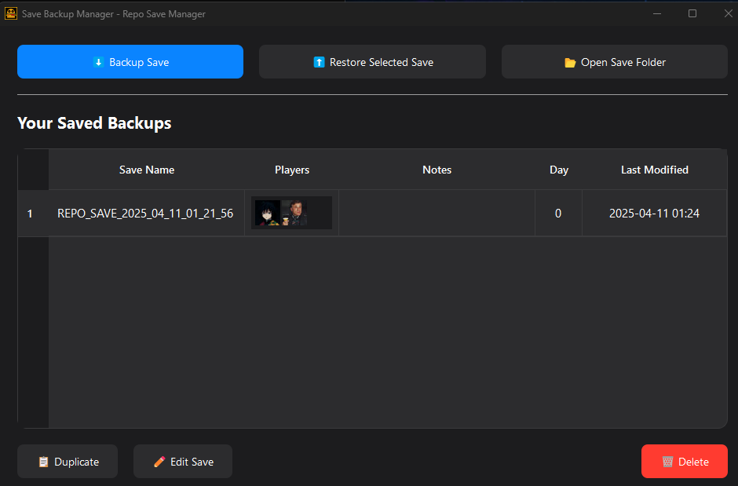
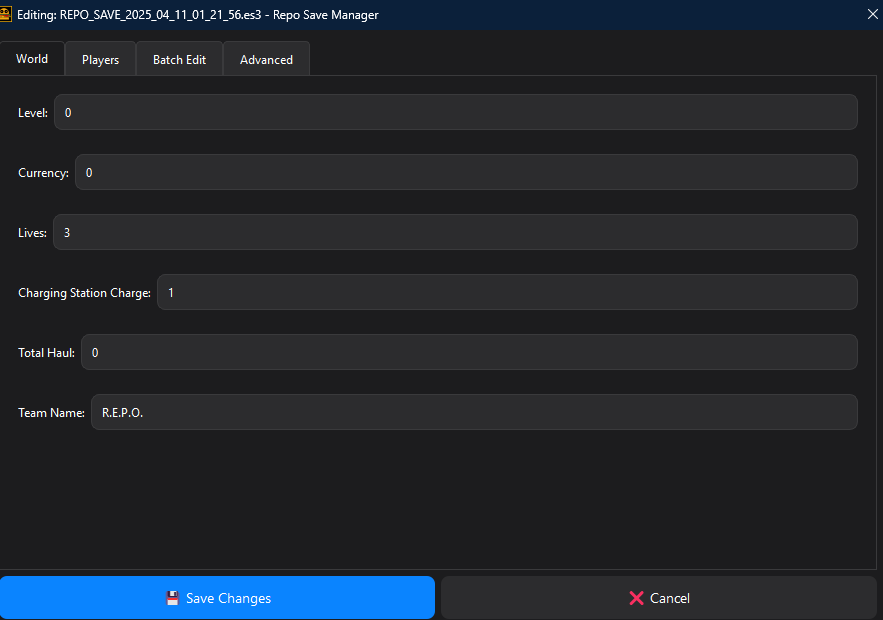

# Repo Save Manager

<div align="center">
  
  
  <h3>A professional tool for backing up, restoring, and editing your R.E.P.O. game saves</h3>

  
  
  
</div>

## ✨ Features

- **💾 Save Management**
  - Create backups of any R.E.P.O game save with an intuitive interface
  - Restore previously backed-up saves with a single click
  - Organize backups with custom descriptions
  - View player information and save stats directly in the app

- **🔍 Advanced Visualization**
  - See Steam profile pictures of all players in each save
  - View save day/level at a glance
  - Add notes to remember important details about your backups

- **🛠️ Edit Capabilities**
  - Built-in save editor with user-friendly interface
  - Modify game values (Currency, Lives, Health, etc.)
  - Adjust player upgrades and team properties
  - Advanced mode for experienced users

## 📸 Screenshots

<div align="center">
  
  
</div>

## 🚀 Installation

### Easy Installation (Recommended)

1. **Download** the latest `RepoSaveManager.exe` from the [Releases](https://github.com/armand0e/Repo-Save-Manager/releases) page
2. **Run** the executable - no installation required!

### For Developers (Source Code)

1. **Clone** this repository
   ```bash
   git clone https://github.com/armand0e/Repo-Save-Manager.git
   cd Repo-Save-Manager
   ```

2. **Set up** a virtual environment (recommended)
   ```bash
   python -m venv venv
   # Windows
   venv\Scripts\activate
   # macOS/Linux
   source venv/bin/activate
   ```

3. **Install** dependencies
   ```bash
   pip install -r requirements.txt
   ```

4. **Run** the application
   ```bash
   python repo_save_manager.py
   ```

## 📖 How to Use

### Backing Up Saves

1. Launch the application
2. Click the "⬇️ Backup Save" button
3. Select the save you want to back up from the dropdown
4. Click "Backup" to confirm

### Restoring Saves

1. Select a save from your backup list
2. Click "⬆️ Restore Selected Save"
3. Confirm the action when prompted

### Editing Saves

1. Select a save from your backup list
2. Click "✏️ Edit Save"
3. Use the intuitive editor interface to modify:
   - World stats (Day, Currency, Lives)
   - Player stats (Health, Upgrades)
   - Advanced settings (for experienced users)
4. Click "💾 Save Changes" when finished

### Managing Your Backups

- Add descriptions to your saves for easy identification
- Delete old backups you no longer need
- Duplicate important backups as needed
- Open the backup folder directly from the app

## 🔧 Technical Details

### Backup Location

Backups are stored in: `%LOCALAPPDATA%\RepoSaveManager\backups`

### Dependencies

- **PyQt6**: Modern UI framework
- **Requests**: For fetching Steam profile pictures
- **Pycryptodome**: For secure save file encryption/decryption

## 🙏 Credits

- Save encryption/decryption methods based on [N0edL's R.E.P.O-Save-Editor](https://github.com/N0edL/R.E.P.O-Save-Editor)
- UI design improvements and additional features by [armand0e](https://github.com/armand0e)
- Logo artwork by [Aceman3k](https://github.com/Aceman3k)

## 🤝 Contributing

Contributions are welcome! Feel free to:

- Report bugs
- Suggest new features
- Submit pull requests

Please check the [issues page](https://github.com/armand0e/Repo-Save-Manager/issues) first.

## 📄 License

This project is licensed under the MIT License - see the [LICENSE](LICENSE) file for details.
